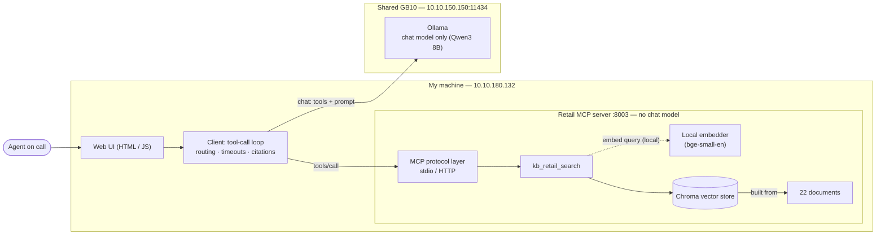
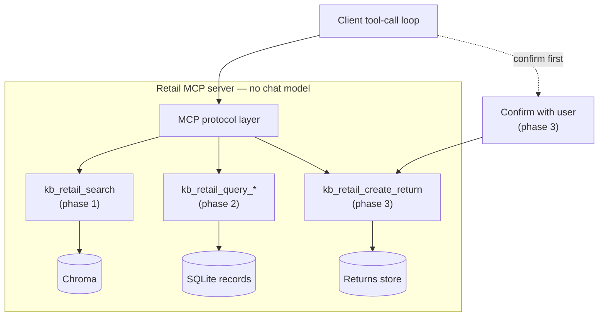
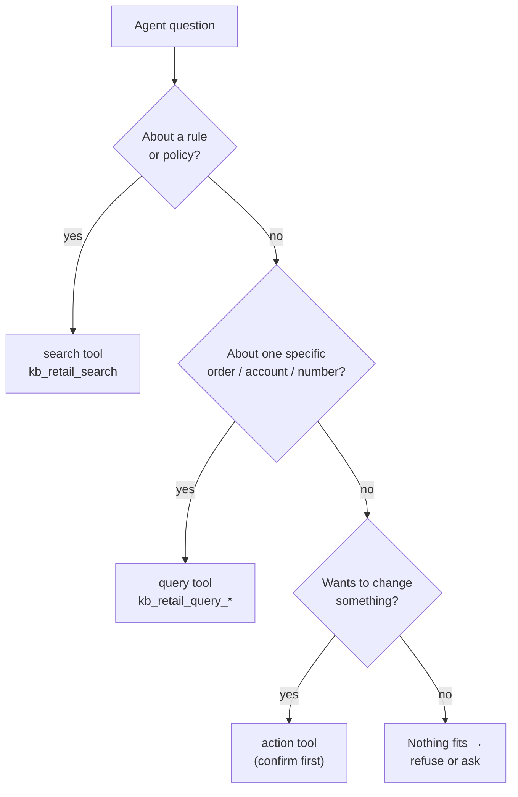
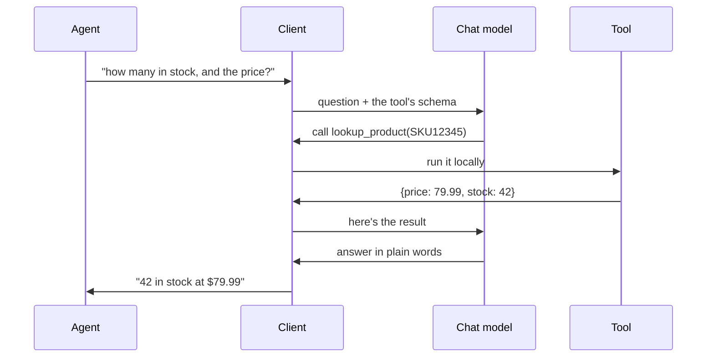
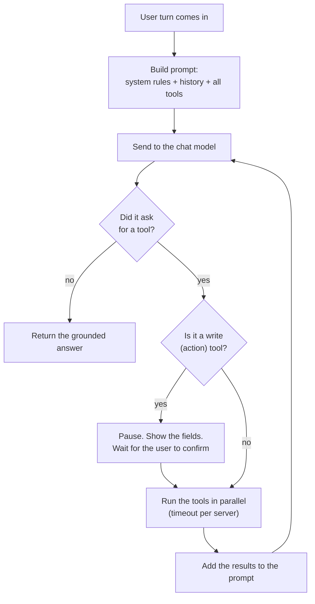
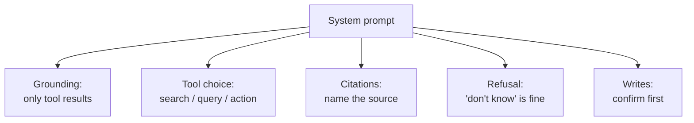
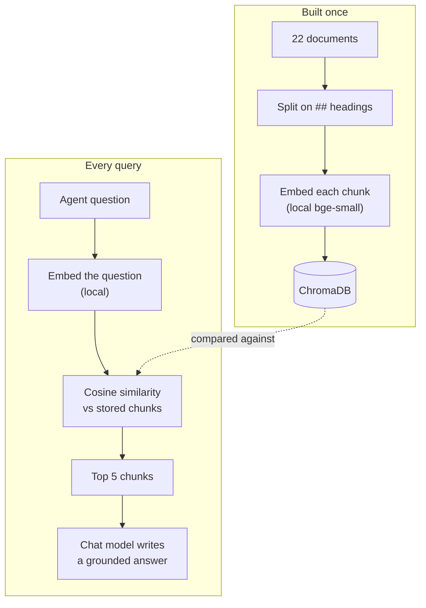

# Design Document — Retail / E-commerce Knowledge Assistant

**Author:** Rishi — Intern 3 (Retail / e-commerce)
**Version:** 1.0 (draft for approval)
**Due:** end of Wednesday 12 August 2026 (design-approval gate)
**Repos:** my code and docs live in my own repo, `rishiupadhyaygithub/retail-mcp-chatbot`. The shared team repo holds the contract and nothing else — per the manager, everything else (including docs) is per-intern.

> **How to read the tags.** **[ASSUMPTION]** is something I'm guessing and will check — each one says how. **[AGREE]** is something the four of us have to settle together (contract v1). **[TODO]** is a value I'll drop in once I have it. I'd rather mark what I'm unsure about than pretend I'm sure.

---

## 0. What this is

An agent is on a live call and needs the right answer fast. Some answers come from **documents** ("how long does a refund take?"), some from **records** ("did this order actually ship?"), and some end in an **action** ("open a return"). So I'm building two things:

1. A **Retail MCP server** that can search documents, look up records, and do one write action.
2. A **chatbot client** that connects to all four interns' servers, works out which server and which kind of tool a question needs, and gives back an answer with its sources — or says it doesn't know.

**The one rule I don't break:** my server never calls a chat model. It only retrieves and looks up. All the thinking and writing happens in the client.

Who does what across the team:

| Intern | Industry | Action tool |
|--------|----------|-------------|
| 1 | Banking | Raise a transaction dispute |
| 2 | Hospitality | Log a guest complaint |
| **3 (me)** | **Retail / e-commerce** | **Open a return / RMA** |
| 4 | Telecommunications | Raise a fault ticket |

For my domain: documents cover order tracking, returns, delivery, payments and warranties. Records are orders, line items, shipments and returns. The action is opening a return.

---

## 1. Architecture

### What runs where

The only thing I share with the team is the **chat model**. It runs on the central **GB10 server** (`10.10.150.150:11434`) through Ollama, and only my client talks to it. My server never does.

Everything else runs on my own machine (`10.10.180.132`): the UI, the client, the MCP server, the vector store, and the embedding model. **Embedding is local** — the server turns a query into a vector itself, using a small model on my host. Nothing about embedding touches GB10 (manager, 2026-08-11).



*Figure 1. The solid boxes are what exists in phase 1. The client has two outbound paths, and only two: it calls GB10 for the chat model, and it calls the retail MCP server for `tools/call`. (It also reaches the three other interns' servers the same way it reaches mine — over HTTP; those peers are left off this figure to keep the retail data flow clear.) The server embeds the query with a local model — that's retrieval plumbing, not generation — and never touches GB10. GB10 holds the chat model only, and only the client calls it.*



*Figure 2. Phase 2 (query tools + SQLite) and phase 3 (the write action + a confirmation step) hang off the same protocol layer and the same client loop. Nothing gets rebuilt when I add them.*

My client connects to four servers in total — mine plus the three others, over HTTP.

### One query, start to finish

Take a question that needs both a document and a record: *"How long does a refund take, and did order 10231's refund go through?"*

1. The UI sends the question to the client.
2. The client builds a prompt: the system rules, the conversation so far, and the list of tools it found on all four servers at connect time.
3. The model asks for two tools: `kb_retail_search` for the policy, and `kb_retail_query_orders` for the order.
4. The client runs both (in parallel, with a timeout per server) and gets back passages and a row.
5. It formats the results compactly and adds them to the prompt.
6. The model writes the answer and cites the document and the row. The UI shows it with the sources underneath.

### Server vs client, drawn clearly

- **The server** takes a query, finds or looks up data, and returns it with some metadata. It never writes prose. It does run a local embedding model to turn a query into a vector, but that's retrieval, same as the index itself — not a chat model. There is no path from the chat model to my server.
- **The client** does all the thinking: routing, picking tools, running the loop, grounding the answer, citing sources, refusing when it should, and confirming before any write.

### Where phases 2 and 3 plug in

Phase 1 ships `kb_retail_search` plus a resource and a prompt. Phase 2 adds **query** tools (`kb_retail_query_orders` and friends) over a SQLite dataset. Phase 3 adds one **write** tool, `kb_retail_create_return`. All three sit on the same server and get discovered by the same client with no client code change — that's the whole point of discovering tools at runtime.

### Language and stack

- **Python.** The official MCP Python SDK is solid, Ollama has a clean Python client, and I've already got the tool-call loop working in Python (see §4). Switching later would cost more than it's worth. **[ASSUMPTION — I confirm this by getting the Inspector smoke test passing on day 1.]**
- **MCP server:** the official `mcp` SDK, serving both stdio and HTTP from one codebase.
- **Vector store:** ChromaDB — local, saves to disk, filters on metadata, almost no setup. FAISS is faster but has no built-in metadata filter, so it'd need more glue. **[ASSUMPTION — I check this once I've ingested the real corpus and measured retrieval speed against my 300 ms target.]**
- **Records store:** SQLite. A few thousand rows doesn't need anything heavier.
- **UI:** minimal, see §6.

---

## 2. MCP, and how I use it

**Spec version: 2026-07-28.** All four of us target this one. I'm working from the spec itself, not just the SDK docs. The four things the brief asks about:

- **The handshake.** Client and server exchange `initialize` / `initialized`. Each sends its `protocolVersion`, its `capabilities`, and some info about itself. If the versions or capabilities don't match, the session fails right here — which is exactly the "initialization failure" case I have to handle without crashing.
- **Capabilities.** Both sides say what they support. My server declares `tools`, `resources`, `prompts` (and probably `logging` **[ASSUMPTION]**). My client only uses a capability after the server says it has it — and it has to survive a server that claims a capability and then doesn't deliver, which is one of the required tests.
- **The three things a server can expose:**

  | Type | Who decides to use it | Mine |
  |-----------|-----------|------|
  | Tools | the model, mid-answer | `kb_retail_search`, later the query and create tools |
  | Resources | the host or user picks | document list; data schema |
  | Prompts | the user, on purpose | one query template |

  If I only built tools, I'd walk away thinking MCP is just REST with a schema bolted on. Resources and prompts are a couple of hours each and make the difference real.
- **Discovery at runtime.** The client calls `tools/list` (and the resource and prompt versions) when it connects. Nothing is hardcoded. If a tool gets renamed in someone's v2, my client picks it up with no change.

Before I write any client code, I run my server through the **MCP Inspector**. If it fails there, it fails everywhere.

---

## 3. Choosing the right tool (the hard part)

By phase 2 the model sees, across four servers, two kinds of tool each plus an action. It has to pick the right server *and* the right kind of tool. "How long does a refund take?" reasonably matches all four servers, so this is the mistake my eval set is built to catch.

Here's the decision the model has to make on every question:



How I try to get the model to follow that tree:

1. **The tool descriptions do most of the work.** The model reads them to pick the server and the tool type, so I write them to be hard to confuse. `kb_retail_search` says *"Search retail policy and help documents — returns, delivery, payments, warranties. Use for 'what's the policy' questions. Not for a specific order."* `kb_retail_query_orders` says *"Look up specific retail orders and shipments by id or customer. Use for 'what happened on this order'. Never for policy."* Vague descriptions are the number-one cause of the model picking wrong, so I spend time here.
2. **The system prompt states the rule.** Policy → search. A specific order or number → query. Change something → action, and only after checking with the user. Full text in §5.
3. **Server by domain.** Route on which industry the question is about. A comparison ("do bank and telco refunds differ?") goes to two servers.
4. **Two things at once.** A question needing a document and a record fires both tool types in one turn (the loop in §5 handles this).
5. **I measure it, I don't assume it.** Routing accuracy is in the scorecard (§7): right server ≥90%, right tool type ≥90%, at most one wasted call per query. **[ASSUMPTION — that description-driven routing hits target on an 8B model. If it doesn't, my backup is a small pre-classifier in the client. Even then, no chat model goes into the server.]**

---

## 4. The chat model, with proof

**Model: Qwen3 8B**, running on GB10 (about 6–8 GB; my local embedder adds roughly 1 GB, on my own machine). Only the client talks to it. Ollama's tool-calling quality varies a lot between models — some claim to support it and then do it badly — and finding that out in week 3 would sink the project. So I ran a full round-trip now to check.

This is the round-trip, drawn out:



And the actual run:

```
MODEL: qwen2.5:7b-instruct
USER:  How many Wireless Headphones (SKU12345) are in stock, and what's the price?
TOOL CALL:   lookup_product({'sku': 'SKU12345'})
TOOL RESULT: {'name': 'Wireless Headphones', 'price': 79.99, 'stock': 42}
FINAL ANSWER: There are 42 units of Wireless Headphones (SKU12345) in stock, at $79.99 each.
PASS: full tool-call loop worked.
```

The script is `client/toolcall_test.py`. I ran it on a `qwen2.5:7b-instruct` instance as a stand-in and will re-run it on `qwen3:8b` once that's pulled on GB10. **[ASSUMPTION — that it stays reliable once all four servers' tools are in the list at once. I re-test after phase-1 integration.]** **[AGREE — the four of us confirm GB10 has Qwen3 8B pulled and that it handles tool-calling. If it doesn't, that's an escalation.]**

---

## 5. Client design

### The tool-call loop



The loop caps at five rounds so a confused model can't spin forever. A write tool never runs on its own — the loop stops, shows the exact fields, and waits for a yes.

### When a server is slow or down

Each server call has a timeout. If it times out or the connection drops, the client keeps going and answers from what it has, with a note ("Telecom server didn't respond; answering from the other three"). It never hangs and never crashes. That covers the required cases: one server down, all down, a server restarting mid-session, bad tool arguments, and a server that claims a capability it doesn't honour.

### First draft of the system prompt

This is what actually enforces grounding, citations and refusals, so it's worth getting an early draft down even if it changes. It has five parts:



The text:

```
You are a contact-center knowledge assistant. An agent is on a live call.

GROUNDING
- Answer ONLY from tool results (retrieved passages or returned rows).
- If the tools return nothing relevant, say you don't know. Never guess a
  policy, a number, a date, or a status.

TOOL SELECTION
- Policy / how-does-it-work questions  -> a *search* tool.
- Specific order/account/number lookups -> a *query* tool.
- Requests to change state (open a return, raise a case) -> an *action* tool,
  and ONLY after confirming the exact fields with the user.
- Pick the tool whose description matches the industry in the question. For a
  comparison across industries, call more than one server.

CITATIONS
- Every claim names its source: the server and the document or the record
  (table + row) it came from.

REFUSAL
- If asked something the tools can't answer, refuse plainly. A refusal is a
  correct answer; a confident wrong answer is the worst outcome.

WRITES
- Never call a write tool unattended. State the fields you will submit and ask
  the user to confirm before executing.
```

Token budgets and exact formatting come later, in the addendum, once I've seen what real chunks look like.

---

## 6. UI

One plain HTML/JS page, served by the client. No framework, no build step. I picked it to match the team and because a static page that fetches the client stands up faster than any toolkit and gives me full control over how sources are shown. It's a replacement for the console, nothing more: one live conversation, no history (reload and it's fresh), and the sources shown under each answer. It grows one step per phase — records show up in phase 2, the confirmation dialog in phase 3. I weighed this on setup cost, as the brief says to; it has to work from the end of phase 1 and isn't where I should spend time. I looked at Streamlit but it ties me to a Python server and isn't on the team's stack, so I dropped it.

---

## 7. How I'll measure it

The **eval set and the harness exist before the chatbot does** — that's the baseline gate. 28 questions, written the way an agent actually asks mid-call, each with what should happen (which document, which query, which action). They live in `eval/`. Categories: document (including two-document answers and questions worded differently from the source), record (including an aggregate), composite, cross-server, action (including one with a missing field, where the client must ask), and unanswerable.

I report the **scorecard twice** — a baseline as soon as retrieval works, and a final one after tuning. Each layer is scored on its own, because a wrong final answer could come from retrieval, routing, the query, or the model ignoring good data:

| Layer | Targets |
|-------|---------|
| Retrieval | Recall@5 ≥85%, Recall@1 ≥60% |
| Routing | right server ≥90%, right tool type ≥90%, ≤1 wasted call/query, cross-server ≥80%, composite ≥80% |
| Records | query correct ≥90%, numbers 100%, honest empty results 100% |
| Answer quality | grounded 100%, citations 100%, correct refusals 100%, false refusals ≤10% |
| Action safety | 0 unwanted writes, 0 made-up fields, action routing 100%, confirmation shown 100% |
| Latency | end-to-end p50 ≤4s, p95 ≤10s, retrieval ≤300ms, query ≤100ms (warm and cold reported separately — Ollama unloads idle models) |
| Tokens | measured, then cut ≥40% vs dumping raw JSON, with no quality drop |
| Robustness | pass/fail, none may crash: one server down, all down, empty query, huge query, wrong-language query, off-topic, 10,000-row match, missing customer ref, two identical requests at once |

The harness is one script, `eval/run_evals.py`, run with one command. It reads the eval set, runs each question in a **fresh session** (otherwise a question passes only because an earlier turn happened to fetch the right passage, and the numbers stop meaning anything), scores each layer, and counts tokens from the baseline run on.

**A target I might push back on [ASSUMPTION]:** Recall@1 ≥60% could be tight if my corpus has genuinely conflicting policies — and the brief wants those. A passage can be "the right one" in more than one way. If the baseline shows this, I'll propose measuring Recall@1 against a set of acceptable passages, and explain why, rather than quietly missing the target.

---

## 8. What could go wrong

| Risk | Chance | Plan |
|------|-----------|------|
| Tool choice below target (the hard one) | High | Descriptions first, client-side classifier as backup, measured early |
| GB10 or Ollama down, or the model can't tool-call | Medium | Escalate straight away; round-trip already verified |
| The four of us can't agree the contract | Medium | Bring a concrete draft to cut the debate short; escalate if we don't converge |
| Retrieval quality on a messy corpus | Medium | It's a bottomless pit — I cap the tuning time and report honestly |
| My machine off during interop → three others blocked | Low chance, high impact | Keep it awake and on the network for shared dates; check reachability before interop |
| Cold-start latency looks like a bug | Medium | Report warm and cold separately; the chat model unloads when idle, and embedding is local so there's no contention |

The estimate I trust least is the client loop plus four-server interop (§9). If that slips, the phase-1 demo slips.

---

## 9. Phase 1 in detail

**The corpus.** 22 real, public documents from four retailers — **Amazon, Best Buy, IKEA, Target** — pulled from their help centres (returns, warranty, delivery, payments, order tracking). I picked these four because their policies genuinely disagree, which is the mess the system has to handle. Every source URL and the date I pulled it are pinned in `data/sources.md`. Public pages only.

- **A deliberate contradiction:** Amazon's ~30-day return window vs Best Buy's 15 days (14 for cellular, plus a $45 restocking fee on activatable devices). And for spread, IKEA's 365 days and Target's 90 — four different answers to "how long do I have to return this?". The system has to give the right company's number, not average them.
- **The wording differs on purpose:** "return" vs "return & exchange" vs "returns & claims"; "refund" vs "money back" vs "credit"; "parcel" vs "order". Retrieval has to match on meaning, not on matching words.
- **Mixed lengths:** 90 to 395 words per document, 3 to 7 `##` sections each, and sections running from 8 to 74 words. The spread is real but narrower than I'd like — I have no genuinely long document, which is why the chunker's oversize-section branch is untested against this corpus, and I say so in the chunking note below.
- **Language:** all English (US retailers). I run one non-English query at baseline just to confirm the embedder degrades gracefully instead of crashing.

Here's the phase-1 pipeline in one picture:



**Chunking.** I split on the markdown `##` heading first, because in these documents a `##` really is a topic boundary — one FAQ, one warranty clause, one fee rule. That is what makes a citation trustworthy: the `section` field points at text a human can go and find. But headings alone are far too small here, and I only know that because I counted. The 22 documents hold **97 `##` sections, median 34 words, mean 35, and the largest section anywhere is 74 words**. The brief asks for passages of a few hundred words, so heading-only chunks come out roughly eight times too small, and a 30-word chunk headed "Exceptions" without the rule it excepts is not an answer. So there is a second step: I **pack adjacent sections from the same document** together until the passage reaches a **target of 100 words**, with a **150-word ceiling** and a **40-word floor**, and I never pack across documents. The one document with prose before its first heading (`ikea/warranty_terms.md`) treats that lead as unit zero, so its "residential use only, proof of purchase" scope rides along with the first chunk instead of being dropped. Each chunk still carries `source`, `section`, `chunk_id` and `document_type` (returns / warranty / delivery / payments / order_tracking); `section` now lists every heading the chunk covers, joined with `" | "` — still a string, so contract v1's `"section": "heading, if available"` still holds — and the document title is prefixed to the embedded text so a chunk headed only "Exceptions" still knows it is IKEA's.

Those three numbers come from the corpus, not from a rule of thumb, and the corpus is small: **3,581 words of prose, documents running 90 to 395 words**. That is the whole tradeoff. If I took "a few hundred words" literally and set the target to 250–350, the packer emits **23 chunks and 21 of the 22 documents collapse into a single chunk** — retrieval stops being passage retrieval and becomes document retrieval, `top_k=5` hands the model a fifth of everything I have, and the `section` list degenerates into "the whole document", which is not a citation. At a 100-word target I get **33 chunks, mean 105 words, median 100, nothing smaller than 71 or larger than 145**; 13 short documents stay whole because they already *are* one passage; and the largest document, `ikea/warranty_terms.md` (395 words, seven product ranges from 25-year kitchens to 10-year mattresses), splits into four. Going smaller — target 80 — buys 40 chunks at a mean of 86 words and costs me something I care about more: with four brands and `top_k=5`, the more chunks one document contributes, the easier it is for a single brand to fill the whole result list, and Amazon's 30 days versus Best Buy's 15 is exactly the question where that would hurt. 100 / 150 / 40 is where a chunk is big enough to hold a rule together with its exception and small enough that no document can own the top five.

**Overlap, honestly.** There is no overlap between packed sections, because the boundaries are real. The only place overlap applies is the branch where a single `##` section is bigger than the 150-word ceiling on its own; there I re-split it with **50 words of overlap** so no clause gets orphaned. On today's corpus **that branch never fires — the largest section is 74 words**. The v1.0 draft of this document said I would re-split "any section over ~400 words (the long disclosures)"; there is no such section, and nothing here even reaches 100, so that rule was unreachable code described as a feature. The branch stays in the ingester because the corpus will grow, but I am not going to claim it is doing work. The 40-word floor is in the same position: it stops the packer emitting a runt tail, and on this corpus it never binds either. Because I would rather measure this than argue it, ingestion takes a `--strategy` flag and writes both granularities to separate collections — `retail_docs_heading` (97 chunks, one per `##`, the naive baseline) and `retail_docs_packed` (33 chunks, the default) — and the harness scores both side by side. **[Verify — the winner is whichever gets the better measured Recall@5 on the 28-question eval set, not whichever I prefer. If packed loses, I keep the heading baseline and say so. If both miss the ≥85% target, I tune `target_words` inside the 80–150 band before reaching for a different splitter.]**

**Vector store.** ChromaDB, local and on disk. Ingestion writes two collections for the baseline A/B — `retail_docs_heading` and `retail_docs_packed` — and whichever wins on measured Recall@5 becomes `retail_docs`, the one collection the server ships against. Each record is `{content, embedding, source, section, chunk_id, document_type}`. The `chunk_id` looks like `retail-doc-3:chunk-12` — the exact format from contract v1, so citations line up across all four servers. The `<n>` is assigned once from a sorted list of the 22 documents and reused by both strategies, so the two scorecards stay comparable and the same passage cites the same way whichever collection answered. Similarity is **cosine**, and I normalize scores to 0–1 before returning them (also contract v1, so they're comparable across servers whatever store each intern uses).

**Embedding, local.** Per the manager (2026-08-11), embedding runs on my own machine, not GB10, with any small model I like. I'm using **`bge-small-en-v1.5`** through `sentence-transformers` — about 130 MB, good on English, fine on CPU, and realistic for the 300 ms target. Backups, all local: `all-MiniLM-L6-v2` (smaller and faster) or `bge-base-en-v1.5` (bigger, higher recall). Since each of us may embed with a different model, the contract normalizes the score to 0–1 so results stay comparable. **[ASSUMPTION — I confirm the pick on measured Recall@5 and switch within this local set if it misses.]** The corpus is all English, so I don't need a multilingual model like bge-m3.

**Retrieval.** `top_k` defaults to 5 (matches the contract). Metadata filtering is there if I need it (e.g. by `source`). If nothing clears a similarity floor **[ASSUMPTION — the floor is tuned at baseline]**, I return an empty `results` array. That's a success, not an error, so the client can tell the model "found nothing" and let it refuse.

**When things fail.** Server down → the client answers from the rest, with a note. Nothing retrieved → refuse, don't invent. Model answering with no evidence → the system prompt forbids it and the groundedness score (100% target) catches it.

---

## 10. Phases 2 and 3 (outline)

**Phase 2 (records).** I'll need about 4–6 SQLite tables — `orders`, `line_items`, `shipments`, `returns`, `customers` — a few hundred to a few thousand rows, and consistent with my documents (if a doc says refunds take five working days, the data shows about five, with a few exceptions). I'll include the awkward cases agents actually call about: a duplicate charge, a partly shipped order, a return already under review, a customer with two accounts. Plus a few documented reference customers for demos. The tools are parameterised, not text-to-SQL — e.g. `kb_retail_query_orders(customer_ref, from_date, to_date, status)` — with results capped and paginated. The one thing this changes in my phase-1 design: the citation format has to carry table + row already, so I build the citation map to hold record references now.

**Phase 3 (the action).** One write tool, `kb_retail_create_return(order_id, line_item_id, reason)`, returning a return reference. A missing required field fails loudly — it never defaults. The client collects the fields, shows them, waits for a yes, then submits. The loop already has that confirm-before-write pause from §5.

Full schemas, result caps, the confirmation flow, token budgets and formatting go in the design addendum, before I build phase 2, with contract v2.

---

## 11. Plan

Two dates are fixed. I plan the rest in half-days and label slack as slack.

**Fixed:** work started Fri 7 Aug 2026. Design doc and contract v1 are due **Wed 12 Aug 2026**, presented at the **3 pm team meeting** — each of us walks through our own doc (no slides), then group discussion and next steps.

| Gate | What it means | Date |
|------|---------|-------------|
| Design review | Walk through this doc at the 3 pm meeting; no code before approval | Wed 12 Aug, 3 pm |
| Baseline scorecard | Eval set + harness done, first numbers — before the server | **[TODO]** ~Fri 15 Aug |
| Interop day (v1) | All four servers live, tested against contract v1 | **[AGREE — shared]** |
| Phase 1 demo | Working document chatbot in the UI | **[AGREE — shared]** |
| Phase 2 & 3 demo | Records, composite answers, a case raised end to end | **[AGREE — shared]** |
| Final demo + retro | Everything, with before/after numbers | **[AGREE — shared]** |

**Rough effort, in half-day units [ASSUMPTION — these are my least-confident guesses]:**

- **Eval set + harness — 1.5 days.** Writing 28 questions with known answers, plus the one-command harness. Gate before the server.
- **Corpus + ingestion — 1 day.** 22 real docs, chunk and embed locally.
- **Phase 1 server + Inspector — 1.5 days.** Both transports, has to pass Inspector and run in someone else's host unchanged.
- **Client + loop + four-server interop + UI — 2.5 days.** The known-hard part, where time disappears. Capped.
- **Phase 2 dataset + query tools — 2 days.** Dataset about a day; the query schemas need agreement across all four (contract v2).
- **Phase 3 write tool + confirmation — 1 day.**
- **Tuning + token cut + final scorecard + retro — 1.5 days.**

**Order I can't get around:** ingestion → retrieval → server → client → phases 2 and 3. Blocked on others: contract v1, interop day and the demos (shared, machines up), and GB10 being available.

The estimate I'd flag is the client + interop one (2.5 days). If it slips, I say so the day I know — a quiet slip makes three other people miss a gate too.

---

## 12. Assumptions, in one place

Everything tagged **[ASSUMPTION]** above and how I settle it: the stack (Inspector test on day 1), the vector store and embedding model (measure recall on the real corpus), the chunking (heading split; tune or fall back to a hybrid on Recall@5), the routing method (measure early, classifier ready as backup), and the Recall@1 target (argue for an accept-set if the contradictions bite). Everything tagged **[AGREE]** is a contract-v1 or shared-schedule item.

What's already settled: spec `2026-07-28`; GB10 (`10.10.150.150:11434`) runs the shared chat model only (Qwen3 8B, client-called); embedding is local on my host (`bge-small-en-v1.5`, off GB10); my server is `10.10.180.132:8003`; the UI is plain HTML/JS. The only open **[TODO]** is the shared demo dates, which we fix as a team.

---

*End of v1.0. I'll get the other three to read it before I submit, and expect one round of changes.*
