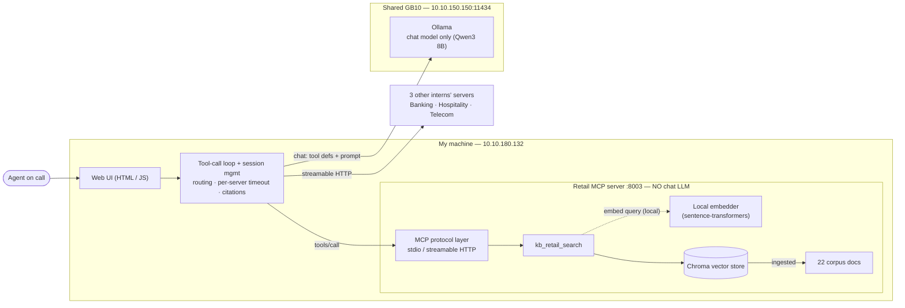

# Design Document — Retail/E-commerce Contact Center Knowledge Assistant

**Author:** Rishi — Intern 3 (Retail / e-commerce)
**Version:** 1.0 (draft for approval)
**Due:** end of Wednesday 12 August 2026 (Design-approved gate)
**Repos:** code + docs in my own repo `rishiupadhyaygithub/retail-mcp-chatbot`. Per manager: code and docs are per-intern; the shared team repo holds the **contract only** and is otherwise unused (even documents are individual).

> **Legend.** Text marked **[ASSUMPTION]** is a guess I will verify — each says how. Text marked **[AGREE]** must be settled jointly with the other three interns (contract v1). Text marked **[TODO]** is a value I fill once I have it (e.g. my machine's IP). Per the brief: a document that labels its uncertainty is stronger than one that performs confidence.

---

## 0. Context

An agent is on a live call and needs a grounded answer fast. Some answers come from **documents** ("how long does a refund take?"), some from **records** ("was this order shipped?"), some end in an **action** ("open a return"). I build (1) a Retail MCP server exposing document search, structured queries, and one write action, and (2) a chatbot host that connects to **all four** interns' servers, routes each question to the right server and the right tool type, and produces a grounded, cited answer — or refuses.

**The one rule:** my MCP server never calls an LLM. Retrieval and lookup in the server; all reasoning and generation in the host.

Industry assignment (from the brief):

| Intern | Industry | Action tool |
|--------|----------|-------------|
| 1 | Banking | Raise a transaction dispute |
| 2 | Hospitality | Log a guest complaint |
| **3 (me)** | **Retail / e-commerce** | **Open a return / RMA** |
| 4 | Telecommunications | Raise a fault ticket |

My domain: documents = order tracking, returns, delivery failures, payments, warranties. records = orders, line items, shipments, returns. action = open a return/RMA.

---

## 1. Architecture

### Components and what runs where

The only shared resource is the **chat model**. **Ollama on the central GB10 server** (`10.10.150.150:11434`) hosts the **chat model only** — called by the client, never by my MCP server. **Embedding runs locally on my own machine** (`10.10.180.132`): the retail MCP server (HTTP transport on port **8003**) embeds queries with a local model via a local library, so nothing embedding-related touches GB10 (per manager, 2026-08-11). Everything except the shared chat model runs on my machine.



*Figure 1. Solid components exist in phase 1. The server embeds a query with a **local** embedding model on my host — retrieval infrastructure, not generation — and never touches GB10 or the chat model. GB10 hosts the shared chat model, called only by the client. All reasoning stays in the client.*

```mermaid title="Figure 2 — Where phase 2 (records) and phase 3 (action) attach"
flowchart LR
  loop["Client tool-call loop"]
  subgraph mcp["Retail MCP server — NO LLM"]
    proto["MCP protocol layer"]
    search["kb_retail_search<br/>(phase 1)"]
    query["kb_retail_query_*<br/>(phase 2)"]
    create["kb_retail_create_return<br/>(phase 3)"]
    chroma[("Chroma")]
    sqlite[("SQLite records")]
    store[("Returns / RMA store")]
  end
  gate["Confirmation gate<br/>(phase 3)"]
  loop --> proto
  proto --> search --> chroma
  proto --> query --> sqlite
  proto --> create --> store
  loop -. "confirm first" .-> gate
  gate --> create
```

*Figure 2. Phase 2 (query tools + SQLite) and phase 3 (write action + confirmation gate) attach to the same protocol layer and the same client loop — nothing gets rebuilt.*

My host connects to **four** MCP servers (four client sessions): my own + the three others over streamable HTTP.

### Data flow for one query, end to end

Example: *"How long does a refund take, and did order 10231's refund actually go through?"* (a composite question).

1. UI sends the user turn to the host.
2. Host builds a prompt: system prompt + conversation so far + the tool catalogue **discovered at runtime** from all four servers.
3. Model emits tool calls. Routing picks the **retail** server, and both tool *types*: `kb_retail_search` (the policy) and `kb_retail_query_orders` (the record).
4. Host runs the calls (in parallel, per-server timeout), gets back passages + rows.
5. Host formats results compactly into the prompt (columnar for rows; strips internal IDs/scores into a citation map).
6. Model produces a grounded answer citing the document and the row. Host renders it with provenance in the UI.

### Server / client boundary (explicit)

- **Server:** takes a query, retrieves/looks up, returns data + metadata. Never generates prose. It **does** run a **local** embedding model on my host to turn a query into a vector — retrieval, not reasoning, and entirely off GB10. "No LLM in the server" means no *chat / generation* model, ever; the local embedder is retrieval infrastructure, like the vector index itself. The chat model (on GB10) is called only by the client — no direct contact between the chat model and the MCP server (confirmed with the manager).
- **Client:** all reasoning — routing, tool selection, multi-round loop, grounding, citation, refusal, confirmation for writes.

### Where phase 2 & 3 tools attach

Phase 1 ships `kb_retail_search` (+ resources + a prompt). Phase 2 adds parameterised **query** tools (`kb_retail_query_orders`, etc.) against a SQLite dataset. Phase 3 adds one **write** tool (`kb_retail_create_return`). All three are the *same server*, discovered by the same client with **no client code change** — that is the point of runtime discovery.

### Language & stack, and why

- **Language: Python.** **[ASSUMPTION → verify by building the Inspector smoke test day 1]** The official MCP Python SDK is mature, Ollama has a clean Python client, and I already proved the tool-call loop in Python (see §4). Rewriting later would cost more than it saves.
- **MCP server:** official `mcp` Python SDK, exposing stdio + streamable HTTP from one codebase (transport is separable from protocol).
- **Vector store:** **[ASSUMPTION]** ChromaDB (local, persistent, metadata filtering, trivial setup). Alternative considered: FAISS (faster, but no built-in metadata filter → more glue). I will confirm after ingesting a real corpus and measuring retrieval latency against the ≤300ms target.
- **Relational store:** SQLite. At a few thousand rows, simpler is better (brief's guidance).
- **UI:** minimal — see §6.

---

## 2. Protocol understanding

**Specification:** Model Context Protocol, spec revision **2026-07-28** — team-aligned, all four interns target this version. I cite the spec itself, not just SDK docs. The four points the brief asks for follow.

- **Initialization handshake.** Client and server exchange `initialize` / `initialized`. Each sends `protocolVersion`, `capabilities`, and implementation info. If versions/capabilities don't line up, the session fails here — this is exactly the "initialization failure" I must handle gracefully rather than crash.
- **Capability negotiation.** Both sides declare what they support. My server **declares**: `tools`, `resources`, `prompts` (and `logging` **[ASSUMPTION]**). My client only uses a capability after the server declares it — and must survive a server that *declares* a capability it then doesn't honour (a required robustness case).
- **The three primitives — who decides to invoke:**

  | Primitive | Invoked by | Mine |
  |-----------|-----------|------|
  | Tools | the model, mid-reasoning | `kb_retail_search`, later `kb_retail_query_*`, `kb_retail_create_return` |
  | Resources | the host/user picks | document list; data schema |
  | Prompts | the user, deliberately | one query template |

  Building only tools would leave me thinking MCP is "REST with a JSON schema attached." Resources + prompts are a couple of hours each and make the distinction concrete.
- **Runtime discovery.** Client calls `tools/list` (and `resources/list`, `prompts/list`) at session start — nothing hardcoded. A tool renamed or added in v2 is picked up with no client change.
- **MCP Inspector** validates my server before I write any client code. If it fails in Inspector it fails everywhere.

---

## 3. Tool-type routing (the hard problem)

By phase 2 the model sees, across four servers, **two tool types each** (search vs query) plus one action — and must pick the right server *and* the right tool type. "How long does a refund take?" plausibly matches all four servers. This is the most common failure the eval set is built to catch.

**My approach (considered, not final):**

1. **Descriptions do the routing.** The tool `description` is how the model picks both server and tool type, so I write them to disambiguate: `kb_retail_search` → *"Search Retail/e-commerce policy & help documents (returns, delivery, payments, warranties). Use for 'what is the policy' questions."* vs `kb_retail_query_orders` → *"Look up specific Retail orders, shipments and returns by id/customer. Use for 'what happened on this order' questions, never for policy."* Vague descriptions are the main cause of mis-routing.
2. **System prompt encodes the rule.** "Policy/how-does-it-work → search. Specific account/order/number → query. Change state → action, and only after confirming with the user." (Full text in §5.)
3. **Server selection by domain match.** Route on which industry the question is about; a comparative question ("do bank and telco refunds differ?") fans out to two servers.
4. **Composite handling.** Questions needing both a document and a record trigger two tool types in one turn (multi-round loop, §5).
5. **Measured, not asserted.** Routing accuracy (server ≥90%, tool-type ≥90%, spurious ≤1/query) is in the scorecard (§7). **[ASSUMPTION]** description-driven routing hits target on an 8B model; if not, my fallback is a lightweight pre-classification step in the host (still no chat LLM in the *server*).

---

## 4. Chat model — with evidence

**Model: `qwen3:8b`** (team-proposed, shared on GB10 — ~6–8 GB; the local embedder adds ~0.1–1.2 GB on my own host, not GB10). The chat model lives on GB10 and is called only by the client. Ollama's tool-calling varies sharply by model and some advertise it while doing it badly — discovering that in week 3 is fatal — so I verified a full round-trip on a Qwen-family instruct model now. Weaker models tested (mistral, gemma) were unreliable. **[AGREE]** all four interns share one GB10 chat model; Qwen3 8B is the current team pick.

Verified tool-call round-trip (retail record lookup):

```
MODEL: qwen2.5:7b-instruct
USER:  How many Wireless Headphones (SKU12345) are in stock, and what's the price?
TOOL CALL:   lookup_product({'sku': 'SKU12345'})
TOOL RESULT: {'name': 'Wireless Headphones', 'price': 79.99, 'stock': 42}
FINAL ANSWER: There are 42 units of Wireless Headphones (SKU12345) in stock, at $79.99 each.
PASS: full tool-call loop worked.
```

Script: `client/toolcall_test.py` (verified on a `qwen2.5:7b-instruct` instance; I re-verify on `qwen3:8b` once it is pulled on GB10). **[ASSUMPTION]** the same reliability holds once four servers' tools are in the catalogue at once; I re-test after phase-1 integration. **[AGREE]** the four of us confirm GB10 has the agreed chat model (Qwen3 8B) pulled and that it handles tool-calling — an escalation item if not.

---

## 5. Client design (sketch)

### The tool-call loop

```
receive user turn
build prompt = system_prompt + history + runtime tool catalogue (all 4 servers)
loop (max 5 iterations):            # cap so a confused model can't loop forever
    response = model.chat(prompt, tools)
    if response has tool_calls:
        run calls in PARALLEL, each with a per-server timeout
        for a write tool: PAUSE — confirm with user, show exact fields, then execute
        append results (compact form) to prompt
        continue
    else:
        return response.content       # final grounded answer
```

### When a server is slow or down

Per-server timeout; on timeout or connection error the host **degrades gracefully** — it returns a partial answer plus a clear note ("Telecom server unreachable; answering from the other three"), never hangs, never crashes. Covers the required cases: one server down, all down, a server restarting mid-session, malformed tool arguments, a server declaring a capability it doesn't honour.

### First draft of the system prompt (actual text — will improve)

```
You are a contact-center knowledge assistant. An agent is on a live call.

GROUNDING
- Answer ONLY from tool results (retrieved passages or returned rows).
- If the tools return nothing relevant, say you don't know. Never guess a
  policy, a number, a date, or a status.

TOOL SELECTION
- Policy / how-does-it-work questions  -> a *search* tool.
- Specific order/account/number lookups -> a *query* tool.
- Requests to change state (open a return, raise a case) -> an *action* tool,
  and ONLY after confirming the exact fields with the user.
- Pick the tool whose description matches the industry in the question. For a
  comparison across industries, call more than one server.

CITATIONS
- Every claim names its source: the server and the document or the record
  (table + row) it came from.

REFUSAL
- If asked something the tools can't answer, refuse plainly. A refusal is a
  correct answer; a confident wrong answer is the worst outcome.

WRITES
- Never call a write tool unattended. State the fields you will submit and ask
  the user to confirm before executing.
```

Context budgets and prompt formatting are deferred to the addendum (once I've measured real chunks), per the brief.

---

## 6. UI

A single **plain HTML/JS page** served by the host — no framework, no build step (chosen to match the team and keep setup near-zero; a static page that `fetch`es the host is faster to stand up than any toolkit and gives full control over how provenance renders). It replaces the console, nothing more. One live multi-turn conversation; **no persistence** (reload = fresh); shows **provenance** (which server + which document/record per claim) beneath each answer; grows one step per phase (records display at phase 2, confirmation dialog at phase 3). No styling system, no component libraries. Weighed on setup cost, as instructed — this must work from the end of phase 1 and is not where time should go. Alternative considered: Streamlit (fast, but Python-server-bound and off the team's stack) — rejected for team consistency.

---

## 7. Evaluation plan

**Eval set + harness exist before the chatbot does** (baseline gate). 25–30 hand-written questions, phrased the way an agent asks mid-call, each recording what *should* happen (which docs / which query / which action). Categories: document (incl. two-document answers and vocabulary differing from source), record (incl. an aggregate), composite, cross-server (≥2 needing another industry + one comparative across two), action (incl. one missing-field → client must ask), unanswerable. Lives in `eval/`.

**Scorecard reported twice** — a baseline as soon as retrieval works, and a final set after tuning. Each layer measured separately (a wrong final answer could be retrieval, routing, query, or the model ignoring good data):

| Layer | Metrics & targets |
|-------|-------------------|
| Retrieval | Recall@5 ≥85%, Recall@1 ≥60% |
| Routing | server ≥90%, tool-type ≥90%, spurious ≤1/query, cross-server synth ≥80%, composite ≥80% |
| Structured | query correctness ≥90%, numerical accuracy 100%, empty-result honesty 100% |
| Answer quality | groundedness 100%, citation accuracy 100%, correct refusal 100%, false refusal ≤10% |
| Action safety | spurious writes 0, fabricated fields 0, action routing 100%, confirmation shown 100% |
| Latency | e2e p50 ≤4s, p95 ≤10s, retrieval ≤300ms, query ≤100ms, MCP overhead ≤100ms (warm vs cold reported separately — Ollama unloads idle models) |
| Token | tokens/query reported then reduced ≥40% vs naive raw-JSON injection, no quality regression |
| Robustness | pass/fail: 1 server down, all down, empty query, 5000-word query, wrong-language query, off-topic, 10000-row match, missing customer ref, two concurrent identical requests — none may crash |

**Harness:** one script (`eval/run_evals.py`), one command, prints the scorecard as one table; reads the eval set, runs each question in a **fresh session**, records per-layer numbers, instruments token counts from the baseline run onward.

**Targets I may argue against [ASSUMPTION]:** Recall@1 ≥60% may be tight if my corpus has genuinely conflicting policies (the brief *wants* contradictions) — a passage can be "correct" two ways. If baseline shows this, I'll propose Recall@1 measured against an accept-set of valid passages, with reasoning, rather than silently missing target.

---

## 8. Risks

| Risk | Likelihood | Plan |
|------|-----------|------|
| Tool-type routing below target (hardest problem) | High | Description-driven first; fallback host-side pre-classifier; measured early |
| GB10 / Ollama unreachable or model can't tool-call | Med | Escalate immediately (brief §13); verified round-trip already done |
| Four-way contract disagreement | Med | Bring a concrete draft (contract v1) to shorten debate; escalate if no convergence |
| Retrieval quality on messy/contradictory corpus | Med | It's a bottomless pit — cap tuning time; report honestly |
| My machine off during interop/demo → 3 others blocked | Low/High-impact | Keep awake + on network for all shared dates; verify reachability before interop |
| Cold-start latency mistaken for bugs | Med | Report warm vs cold separately; chat model on shared GB10 unloads when idle — embedding is local, so no ingestion contention |

Least-confident estimate: **the client's tool-call loop + four-server interop** (§9). If it slips, phase 1 demo slips.

---

## 9. Phase 1 in detail

**Corpus (sources).** 15–40 real public documents from **four** retailers chosen for *genuinely conflicting* policies — **Amazon, Best Buy, IKEA, Target** — drawn from their help centres and returns / warranty / delivery / payments / order-tracking pages. Public pages only; every source URL + retrieval date is pinned in `data/sources.md`. **21 documents sourced** (all five document_types × four retailers, plus one long IKEA limited-warranty-terms doc for the length mix).
- **Deliberate contradiction pair:** Amazon's ~30-day standard return window vs Best Buy's 15-day window (14 days for cellular devices; a $45 restocking fee on activatable devices) — the system must surface the conflict, not blend the two into one wrong number. Bonus spread: IKEA 365-day and Target 90-day — four different windows for one question.
- **Vocabulary deliberately differs** across companies: "return" (Amazon/Target) vs "return & exchange" (Best Buy) vs "returns & claims" (IKEA); "refund" vs "credit / money back"; "package / parcel" vs "order"; "restocking fee" (Best Buy) vs "No Lemon Policy" (Target) vs no such concept (IKEA). Retrieval must match on meaning, not string overlap.
- **Mixed length:** short (a single account-return FAQ, ~60 words) through long (a full terms-of-sale / limited-warranty disclosure, several thousand words across many subsections) — uniform length hides chunking bugs.
- **Language:** all sources are English (US retailers). None non-English is required; I run one non-English query at baseline to confirm the embedder degrades gracefully rather than crashing.

**9. Ingestion & chunking.** **Split by section (markdown `##` heading), not fixed token count.** Every sourced doc is saved as markdown with `##` marking natural topic boundaries (an individual FAQ, a named warranty clause). Splitting on those boundaries keeps each chunk topically self-contained, which is what makes a citation trustworthy — the `section` field maps 1:1 to a real heading. **Overlap:** none between sections (boundaries are semantic, not arbitrary); for any section over ~400 words (the long disclosure docs), a secondary split with ~50-word overlap so no clause is orphaned. **Metadata per chunk:** `source` (doc title), `section` (heading text), `chunk_id`, `document_type` ∈ {`returns`, `warranty`, `delivery`, `payments`, `order_tracking`}. **Why not fixed-token:** a fixed size would cut the short FAQ needlessly and slice mid-clause through the long disclosures — the brief flags uniform chunking as the weak default. **Verify:** tune on real Recall@5; if heading-split underperforms on the long docs, fall back to heading-then-token hybrid before phase 2 adds token pressure.

**10. Vector store & data model.** ChromaDB (local, persistent on disk). One collection (`retail_docs`); schema per record: `{content, embedding, source, section, chunk_id, document_type}`. **`chunk_id` format `retail-doc-<n>:chunk-<n>`** (e.g. `retail-doc-3:chunk-12`) — the exact contract-v1 format so citations are portable across all four servers. Indexing: HNSW (Chroma default; negligible impact at <100 chunks). Similarity: **cosine, scores normalized 0–1** before return (contract v1 — comparable across all four servers regardless of store). Why Chroma: metadata filtering + persistence + near-zero setup; weighed against FAISS (faster, no built-in metadata filter → more glue).

**11. Embedding model (local, on my host — not GB10).** Per the manager (2026-08-11), all embedding runs on my own machine, off GB10, with any library/small model of my choice. **Pick: `BAAI/bge-small-en-v1.5`** via `sentence-transformers` (local, ~130 MB, strong English retrieval, CPU-friendly, ≤300 ms target realistic). Reserve alternatives (all local): `all-MiniLM-L6-v2` (~90 MB, lighter/faster) or `bge-base-en-v1.5` (heavier, higher recall). Because each intern embeds locally with a possibly different model, the contract normalizes `score` to 0–1 so results stay comparable across servers. **[ASSUMPTION]** confirm the pick on measured Recall@5 at baseline and switch within this local set if it misses target. Corpus is all English, so bge-m3's multilingual headroom isn't needed.

**12. Retrieval strategy.** `top_k` default 5 (matches contract). Metadata filtering available (e.g. by `source`). **No-match handling:** below a similarity floor **[ASSUMPTION: threshold tuned on baseline]**, return an empty `results` array — a success, so the host can pass "found nothing" to the model verbatim and refuse.

**13. Failure handling.** Server down → host degrades (partial + note). Empty retrieval → refuse, don't invent. Model answering without evidence → system prompt forbids it and groundedness scoring (100% target) catches it.

---

## 10. Phases 2 & 3 — outline (half page)

**Phase 2 (records).** Data I'll need: ~4–6 SQLite tables — `orders`, `line_items`, `shipments`, `returns`, `customers` — a few hundred to a few thousand rows, **consistent with my documents** (if a doc says refunds take 5 working days, the data shows ~5, with a few exceptions). Include awkward cases: a duplicate charge, a partially shipped order, a return already under review, a customer with two accounts. 3–4 documented reference customers for demos. Tools (parameterised, **not** text-to-SQL): e.g. `kb_retail_query_orders(customer_ref, from_date, to_date, status)`. Results capped + paginated with a truncation flag. What would change my phase-1 design if wrong: the citation format must already carry table+row provenance, so I design §1's citation map to hold record refs now.

**Phase 3 (actions).** One write tool: `kb_retail_create_return(order_id, line_item_id, reason)` → returns a return/RMA reference. Missing required field **fails loudly**, never defaults. Client collects fields, confirms with the user showing exact fields, then executes. What would change phase-1: the host's loop already has the confirm-before-write pause (§5).

Full schemas, result caps, confirmation flow, context budget, and prompt formatting go in the **design addendum** (before phase-2 build, with contract v2).

---

## 11. Plan (this is a graded deliverable)

Two dates are fixed; I plan the rest at half-day granularity, with slack labelled as slack.

**Fixed:** Task starts Fri 7 Aug 2026 · Design doc + contract v1 due **Wed 12 Aug 2026**, presented at the **3pm team meeting** — each intern walks through their own doc (no slides), followed by group discussion and next steps.

**Gates in order (sequence fixed; dates chosen — shared ones marked [AGREE]):**

| Gate | Meaning | Target date |
|------|---------|-------------|
| Design review + present | Walk through this doc at the 3pm team meeting (no slides); group discussion + next steps; no code before approval | Wed 12 Aug, 3pm |
| Baseline scorecard | Eval set + harness done, first numbers — **before** the server | **[TODO]** ~Fri 15 Aug |
| Interop day (v1) | All 4 servers live, cross-tested vs contract v1 | **[AGREE — shared]** |
| Phase 1 demo | Working document chatbot in the UI | **[AGREE — shared]** |
| Phase 2 & 3 demo | Records, composite, a case raised end to end | **[AGREE — shared]** |
| Final demo + retro | Everything + before/after numbers | **[AGREE — shared]** |

**Effort per phase, and what drives it (half-day units, [ASSUMPTION] — my least-confident estimates):**

- **Eval set + harness — 1.5 days.** Driven by hand-writing 25–30 questions with known answers and a one-command harness. Gate before server.
- **Corpus + ingestion — 1 day.** 22 real public retail docs (four companies, deliberately messy, ≥1 contradicting pair), chunk + embed **locally** on my host (no GB10 contention, since embedding is off GB10).
- **Phase 1 server (search + resources + prompt) + Inspector — 1.5 days.** Both transports; must pass Inspector and run in a third-party host unmodified.
- **Client + tool-call loop + 4-server interop + UI — 2.5 days.** Known-hard; where time disappears; capped.
- **Phase 2 dataset + query tools — 2 days.** Dataset ~1 day; query tool schemas need **[AGREE]** across all four (contract v2).
- **Phase 3 write tool + confirmation — 1 day.**
- **Tuning + token reduction + final scorecard + retro — 1.5 days.**

**Dependencies (can't parallelise out of these):** ingestion → retrieval → MCP server → client → phases 2 & 3. Blocked-on-others: contract v1 (all four), interop day + all demos (shared, machines up), GB10/Ollama availability.

**Where my risk is:** the client + interop estimate (2.5d) is least confident. If it slips, I flag it the day I know, not on the gate — a silent slip makes three other people miss a gate too.

---

## 12. Assumptions register (summary)

Every **[ASSUMPTION]** above, and how I resolve it: stack (build Inspector test day 1), vector store & embedding (measure recall on real corpus), chunk strategy (heading-split; tune / fall to hybrid on Recall@5), routing method (measure early, host-side fallback ready), Recall@1 target (argue accept-set if contradictions bite). Every **[AGREE]** is a contract-v1 / shared-schedule item. Resolved values now baked in: spec `2026-07-28`; GB10 Ollama `10.10.150.150:11434` = **shared chat model only** (Qwen3 8B, client-called); **embedding local on my host** (`bge-small-en-v1.5`, off GB10); my host `10.10.180.132:8003`; UI plain HTML/JS. Design review is the **3pm Wed 12 Aug** meeting (walk through the doc, then group discussion + next steps). Only remaining **[TODO]**: the shared demo dates (interop + three demos), filled once the team fixes them.

---

*End v1.0. Peer-review with the other three before submitting. Expect one revision round — do not submit at the last hour.*
